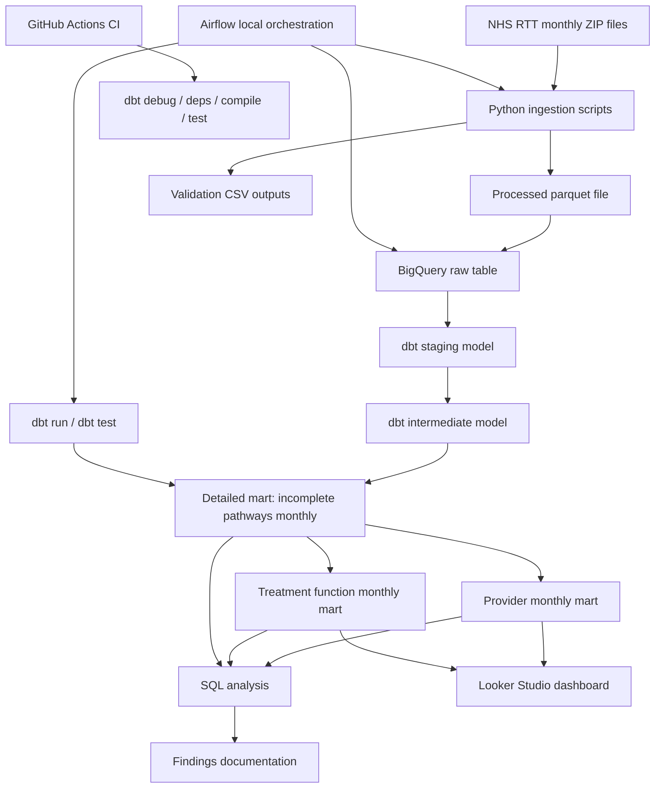

# Architecture

## Main components

- **Python scripts** build the raw analytical base file from NHS monthly ZIP extracts.
- **BigQuery raw table** stores the loaded base dataset.
- **dbt staging** standardises naming, dates and data types.
- **dbt intermediate model** applies the core semantic filter for `Part_2` incomplete pathways and excludes `C_999` aggregate rows.
- **dbt marts** expose reusable analytical datasets for detailed, provider-level and treatment-function-level analysis.
- **GitHub Actions** runs dbt validation automatically on push and pull requests.
- **Docker** provides reproducible local execution.
- **Airflow** orchestrates the local ELT workflow from raw files to tested marts.
- **Looker Studio** is planned as the BI layer on top of BigQuery marts.