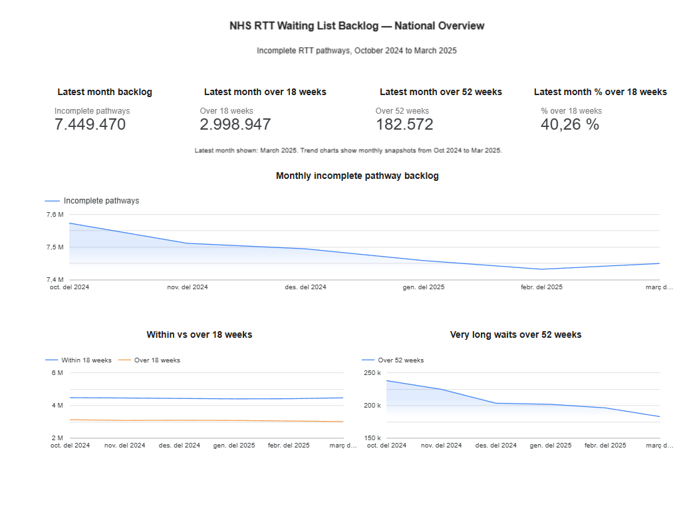
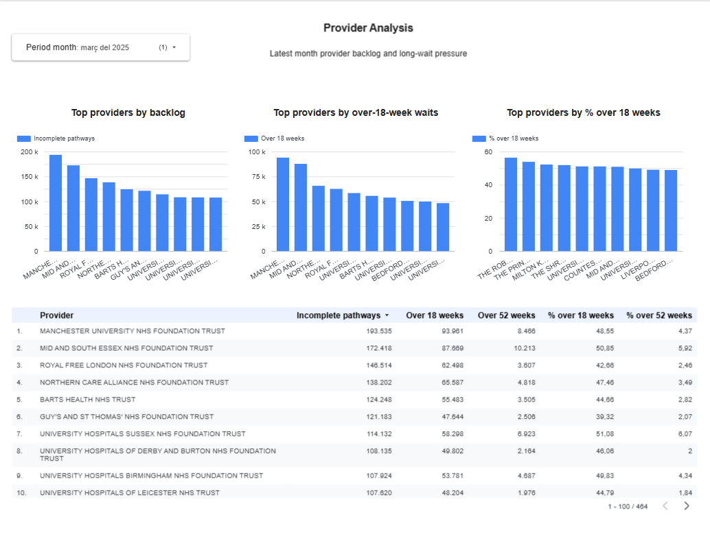
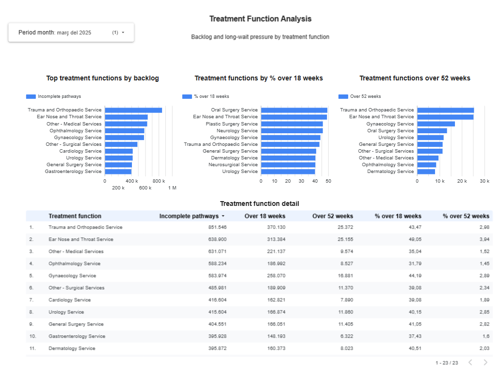

# Dashboard

The project includes a Data Studio dashboard connected directly to BigQuery marts.

## Pages

### 1. National Overview

Shows national monthly RTT incomplete pathway backlog trends, including:

- latest month backlog
- latest month over-18-week waits
- latest month over-52-week waits
- monthly backlog trend
- within vs over-18-week trend
- over-52-week trend

### 2. Provider Analysis

Shows provider-level backlog and long-wait pressure for the latest reporting month.

Main views:

- top providers by incomplete pathway backlog
- top providers by over-18-week waits
- top providers by percentage over 18 weeks
- provider detail table

Provider percentage rankings should be interpreted together with backlog volume, because smaller providers may appear as relative outliers.

### 3. Treatment Function Analysis

Shows treatment-function-level backlog and long-wait pressure.

Main views:

- top treatment functions by backlog
- treatment functions by percentage over 18 weeks
- treatment functions by over-52-week waits
- treatment function detail table

## Screenshots

### National Overview

### Provider Analysis

### Treatment Function Analysis

